# Graphide

Review agent changes as flow graphs. Point the panel at any local repo.

Needs [Rust](https://rustup.rs) and [Node.js](https://nodejs.org) on PATH. Ubuntu also needs a C compiler: `sudo apt install build-essential`. macOS needs Xcode CLT: `xcode-select --install`.

The same VSIX installs into **Cursor** and VS Code (`engines.vscode` ^1.85.0). One-click installers try the `cursor` CLI first, then `code`. Language plugins (Rust, Python, JavaScript, TypeScript, C, C++, Go) ship in the CLI. Query langs match the Rust deriver: **TypeUses**, an **import map**, **Imports** edges when a name resolves through that map (`from pkg import T` / `import { T }` / `import pkg`), and **Endpoint** / Publishes / Subscribes / Reads. `graphide plugins --check` verifies every deriver after copy.

## Install (live)

Caps from `bash install.sh` in this VM. Windows (`install.cmd`) and macOS (`install.command`) run the same steps. More in [`install_sample/`](install_sample/).

**1. One-click scripts** in the Graphide source repo (not the folder you Review):

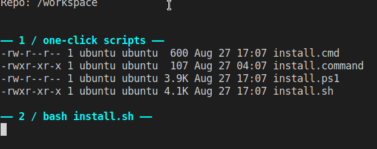

**2. CLI + plugins + VSIX** — every deriver must pass before the panel is installed into Cursor, then VS Code:

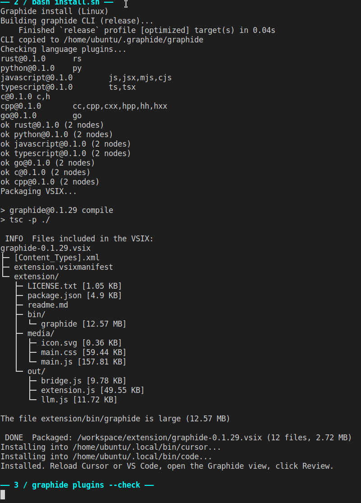

**3. Check again, then reload Cursor** → Graphide → **Review**:

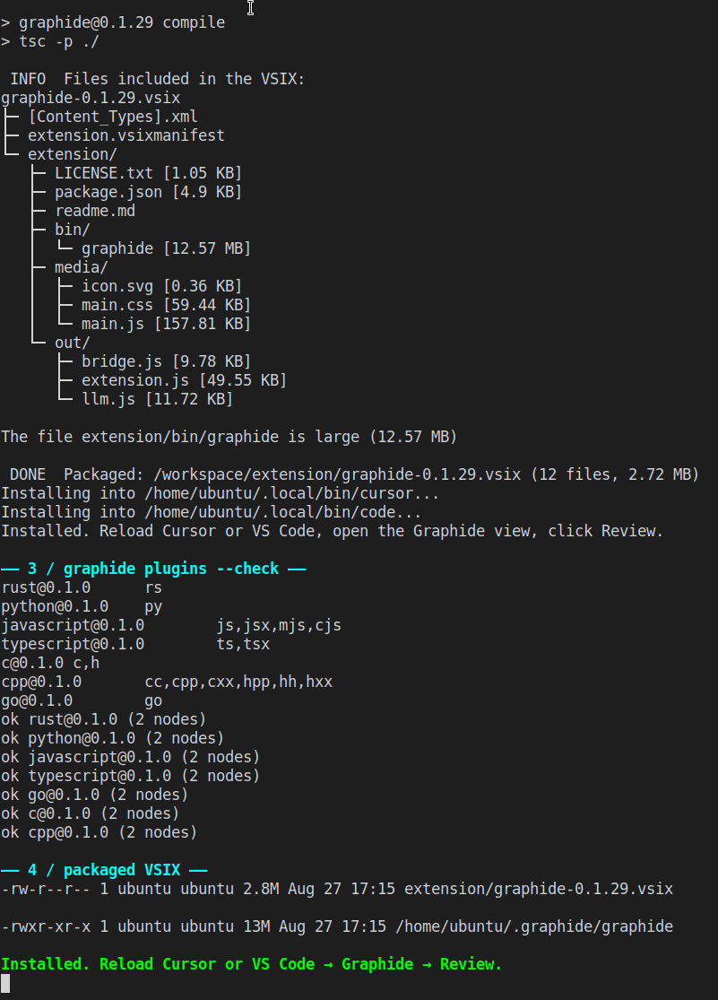

## Review panel

After **Review**, the panel lands on **Overview** with a default run (`overview` + `control-flow`). Play walks **Start → features → end**. Other workspaces: **Map**, **Slice**, **Lineage**, **Decisions**, **Registry**, **Timeline**. Caps below are a live SolarSim pass after the Imports plugin match (**349 nodes · 1222 edges · 57 files**, **457 Imports**, harness **PASS 57/57**). The desk has **Day** and **Night** appearance (header control, key `D`, or `graphide.appearance`: `auto` / `day` / `night`). Auto follows the Cursor / VS Code color theme. The object rail is a source list of names; the footer is one caption. Endpoint / pub-sub hops match Rust on the same derivers; SolarSim’s edge mix did not change from Endpoints. More in [`UIUX_sample/`](UIUX_sample/).

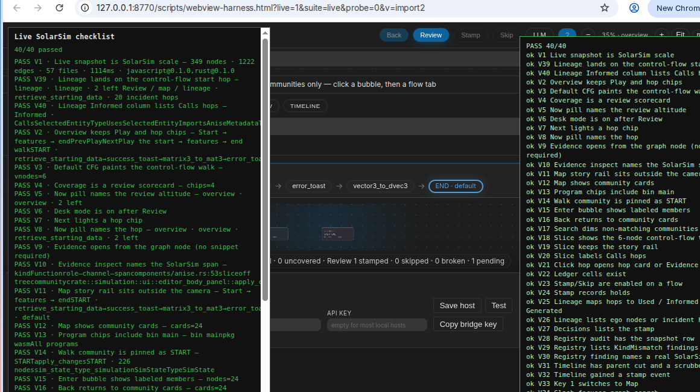

**Day** and **Night** on the same SolarSim snapshot:

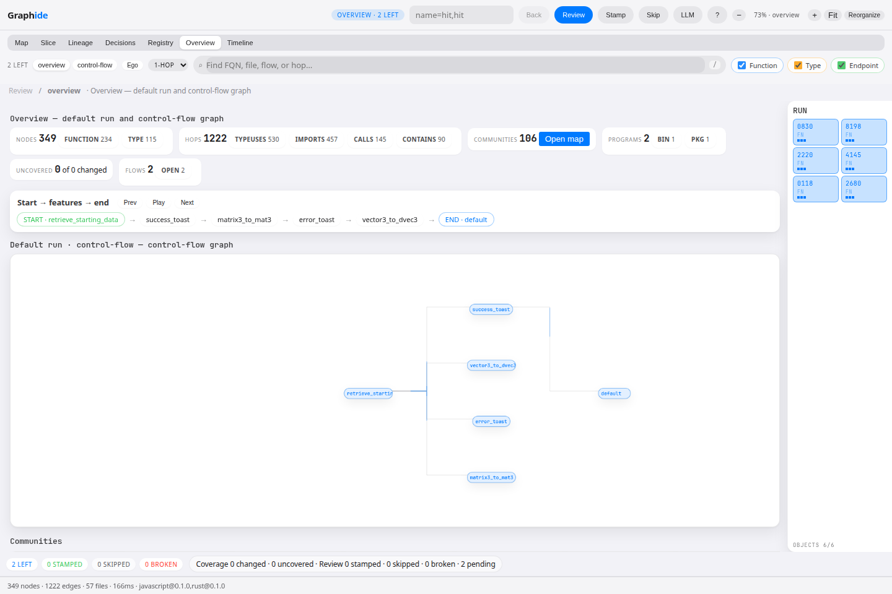

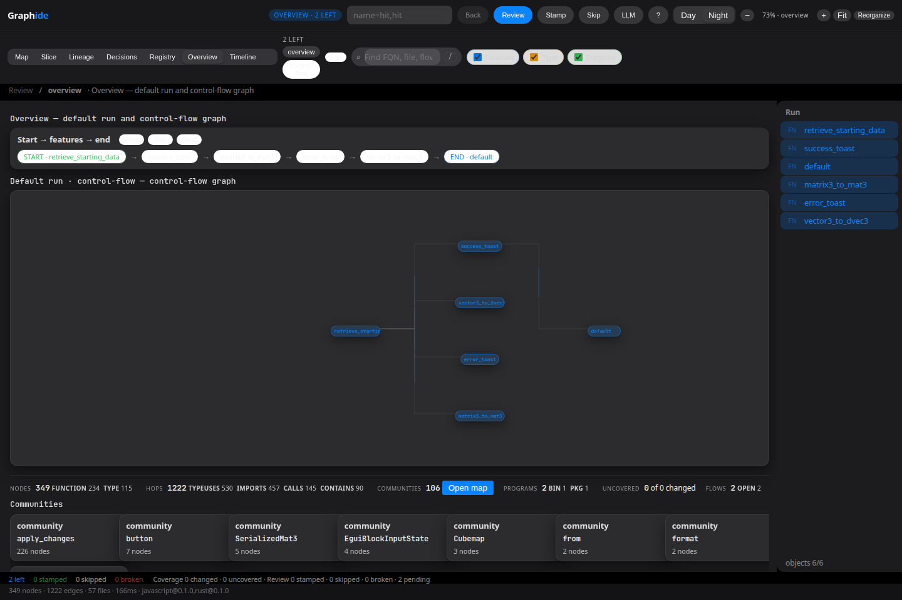

**Overview** — scorecard, Play / Prev / Next, Evidence on the current hop:


**Map** — communities on the walk; click a bubble to Enter. **Slice** — Steiner control-flow:

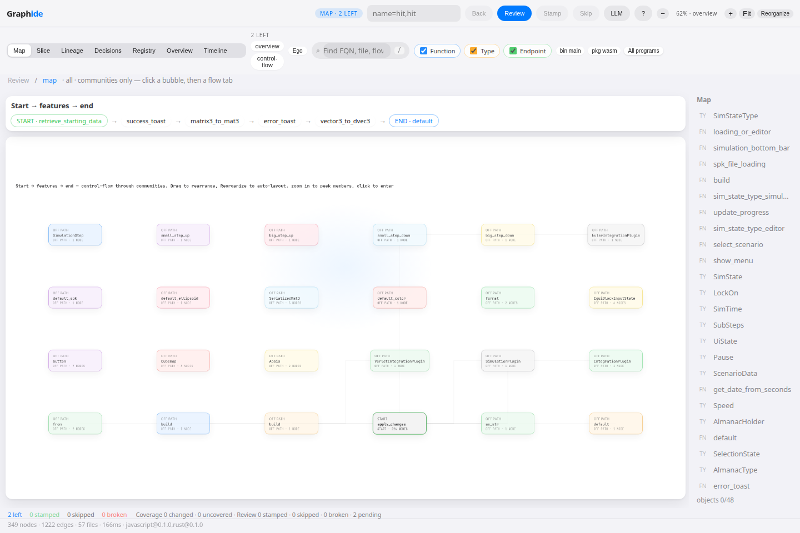

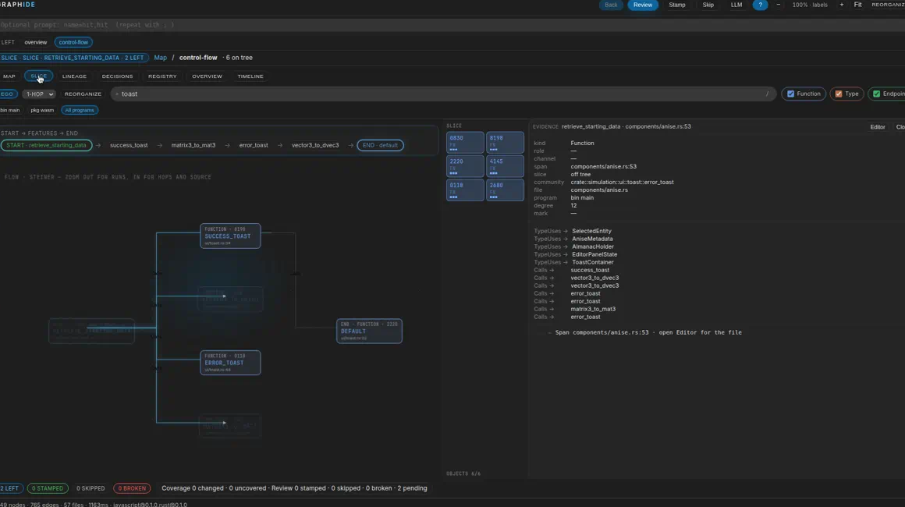

**Lineage** — ego of the start hop, Used / Informed / Generated. **Registry** — snapshot audit:

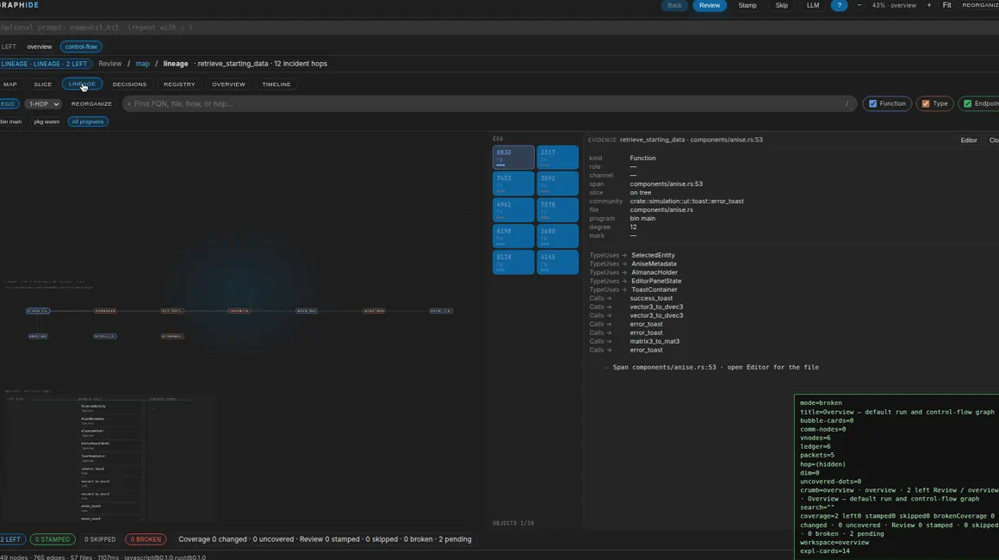

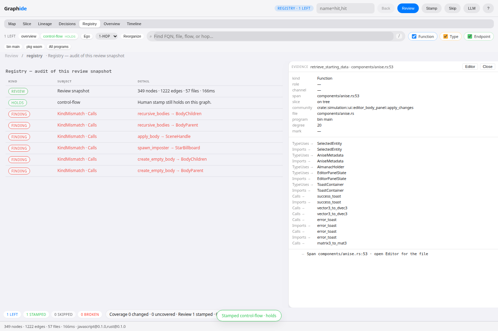

**Decisions** — stamps, skips, broken attestations:

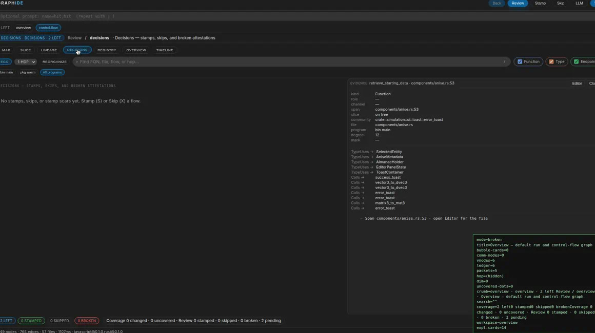


## Windows

1. Double-click **`install.cmd`**.
2. Reload **Cursor** or VS Code.
3. Open the folder to review → **Graphide** → **Review**.

The CLI is copied to `%USERPROFILE%\.graphide\graphide.exe`. You do not set `graphide.cliPath`.

## macOS

1. Double-click **`install.command`** (or run `bash install.sh` in Terminal).
2. If macOS blocks it: right-click → Open.
3. Reload the editor → **Graphide** → **Review**.

The CLI is copied to `~/.graphide/graphide`.

## Linux (Ubuntu)

```bash
sudo apt install build-essential
bash install.sh
```

Then reload **Cursor** or VS Code. If neither `cursor` nor `code` is on PATH, use **Extensions → … → Install from VSIX…** and pick the newest `extension/graphide-*.vsix`.

## Already have the extension?

Command Palette → **Graphide: Install (one click)**. Same build + copy on Windows, macOS, and Linux. If it asks for a folder, pick the **Graphide source repo** (this tree — has `crates/graphide-cli`), not the project you are reviewing.

## Review another repo

Open that repo (e.g. SolarSim) and click **Review**. Do **not** run `cargo build -p graphide-cli` there — that package only exists in this Graphide source repo. Use `%USERPROFILE%\.graphide\graphide.exe` (or `~/.graphide/graphide`) instead.

After Review the panel lands on **Overview** with a **default run**: an `overview` flow from derived entries and a `control-flow` Steiner along Calls/Reads/Writes/Publishes/Subscribes. No `flows.toml` required. Other workspaces stay: **Map**, **Slice**, **Lineage**, **Decisions**, **Registry**, **Timeline**. Search, kind filters, hop cards, and the inspect rail stay on every graph workspace. Programs are a legend filter (file projection), not a new IR kind.

Geometric zoom is automatic LOD on this canvas: **overview → labels → hops → source**. Zooming out past overview pops one clustering level (members → communities, or inner world → parent). **Enter** (click a run or bubble) is still a world jump — the camera never dumps every function.

This is not [Graphify](https://github.com/Graphify-Labs/graphify) and not a [Semantica](https://github.com/semantica-agi/semantica) embed. No Sigma.js / ForceAtlas2 hairball, no SPARQL, no ontology authoring, no entity merge. Graphide keeps a closed review vocabulary (`Function|Type|Endpoint`, spanned edges, stamps, coverage) and projects those objects through explorer workspaces.

## LLM (any host, or a local port)

Graphide can **call** an OpenAI-compatible host and **listen** so any LLM client can call it.

1. Command Palette → **Graphide: Connect LLM**. Pick Local Ollama (`http://127.0.0.1:11434/v1`), LM Studio (`:1234`), llama.cpp (`:8080`), OpenAI, or a custom `/v1` URL. Paste an API key if the host needs one (Secret Storage). Local hosts can leave the key empty.
2. Or set `graphide.llm.baseUrl` + `graphide.llm.model`.
3. In the Review panel, **LLM** (or `L`) opens Ask. Questions are grounded on the current derived flow (start → features → end). The model **never stamps**.
4. A local bridge listens on `127.0.0.1:8787` (`graphide.bridge.port`). **Graphide: Copy Bridge API Key**, then point any client at `http://127.0.0.1:8787/v1` with `Authorization: Bearer <key>`. Routes: `/health`, `/v1/review`, `/v1/path`, `/v1/ask`, `/v1/chat/completions`.

Without a host, Ask still answers from the review graph. Reinstall the VSIX after this change.

## Prompt

Optional: `name=hit,hit` (repeat flows with `;`). Hits are unique FQN suffixes. The slice is a Steiner tree on the derived graph — static extract, not a live debugger.

## Stamp and coverage

After Review, **Stamp** (or `S`) writes a human attestation to `.graphide/stamps/<flow>.json`. **Skip** (or `X`) leaves that flow unstamped for this session. The next Review rechecks saved stamps: a new hop is a scar on the tree (`StampBroken`).

If the folder is a git repo, Review extracts `HEAD^` as the parent revision so coverage can flag changed nodes not on any proposed tree, and bubble ids stay sticky across that cut. Set `graphide.parentRoot` to override, or pass `--no-parent` on the CLI.
